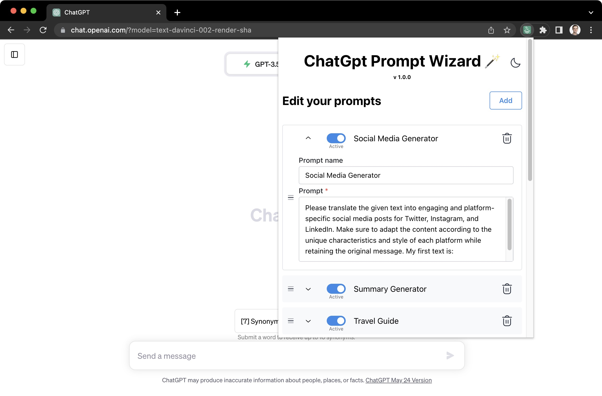
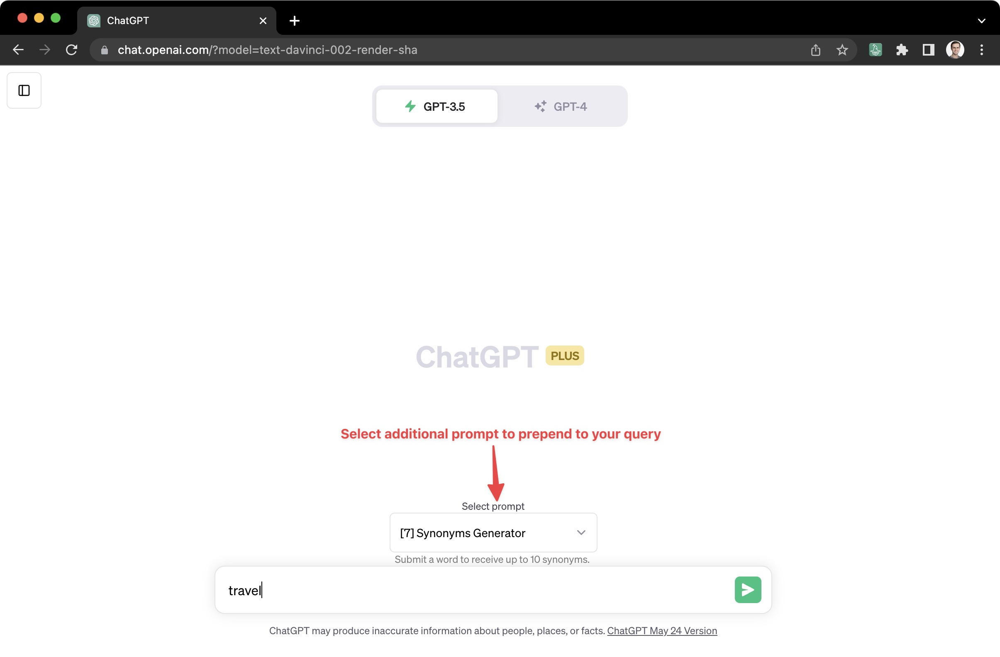
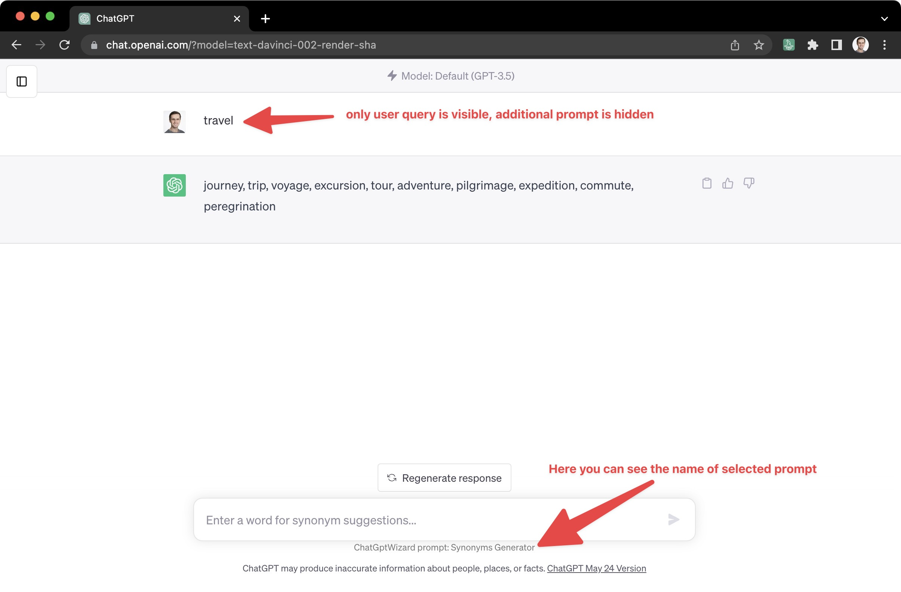
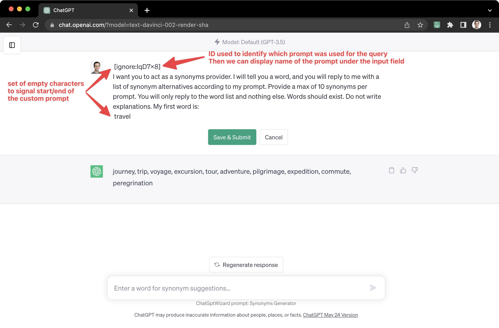

# ChatGPT Prompt Wizard

Streamline your ChatGPT experience with the ChatGPT Prompt Wizard, a Chrome extension that enhances your interactions with the AI model. Select from preconfigured prompts or create your own to save time and get more accurate responses.


[Checkout in the Chrome Web Store](https://chrome.google.com/webstore/detail/chatgpt-prompt-wizard/jmhbafgcjejgjglggikgabbaleaacadc)

[Watch the demo](https://www.youtube.com/watch?v=1xKhDSJ3rJw)


## Features
* Prepend custom prompts to ChatGPT queries
* Select from preconfigured prompts
* Create custom prompts
* Quick selection using keyboard shortcuts
* In-built prompt management system

## How It Works
The extension stores user-defined prompts in the local storage, which can be created, edited, or deleted via the extension UI built with [Mantine](https://mantine.dev/) components library.


When a user selects a prompt from the custom dropdown inserted into the ChatGPT UI and submits their query, the extension prepends the selected prompt to the user's query.



To minimize distraction, the extension hides the original prompt from the UI, displaying only the user's query.



The prepended prompt is wrapped in a custom set of empty characters, enabling the extension to identify and hide it.
Upon submission, the dropdown is hidden and replaced by a label displaying the initially selected prompt's ID `[ignore:${selectedPrompt.id}]`. 
This ID doesn't affect the ChatGPT response, but helps identify the prompt. To view the full prompt in the app, users can click the edit button next to your original query.



## Project Structure
```bash
    .
    ├── ...
    ├── builds              # Contains zip files with built versions of extensions deployed to Chrome store
    ├── build               # Contains the latest build of the extension (not available in the in store)
    ├── extension_assets    # Contains advertising images (including Photoshop files) used in the Chrome extension web store
    ├── public              # Public assets like images and icons used by the extensions
    ├── src                         # Source code in TypeScript
    │   ├── background/index.ts     # Background script used to initialize the local storage
    │   ├── content                 # Contains code that is run on the chatGPT website to render additional UI and handle the custom prompts
    |   |   ├── ...
    |   |   ├── index.tsx           # Main file that observes the website updates and renders the custom UI
    |   |   ├── hijack-inputs.ts    # Functions that intercepts the submit events on the chatGPT form to prepend custom prompts
    |   |   ├── PromptsDropdown.tsx # Component for the prompts dropdown selector
    |   |   └── ui-manipulation.ts  # Code responsible for appending custom UI to the website and hiding the custom prompts which are appended to the request
    │   ├── popup                   # Contains extension interface for editing custom prompts. React app written in TypeScript with the use of @mantine components
    │   ├── utils                   # Contains code that is run on the chatGPT website to render additional UI and handle the custom prompts
    |   |   ├── local-storage.ts    # Code responsible for handling all local storage events like adding new prompts, saving user selection, etc
    |   |   └── prompts.ts          # List of initial/built-in prompts that the extension is shipped with
    │   └── utils                    # Unit tests
    ├── bump-version.js     # Script which handles bumping the project version, creating a build project in a zip file ready for submission to Google store, and creating a git tag
    └── ...
```


## Installation
Clone the repository, navigate to the project directory, and install the dependencies:

```
git clone https://github.com/MateuszSiek/chat-gpt-wizard.git
cd chat-gpt-wizard
npm install
```

## Development
When working on the content scripts, please note that hot reloading may not work as expected. Often, it's required to manually execute `npm run build` and reload the extension in the browser. This is not the most efficient development experience and there are plans to improve this in the future.

On the other hand, the development of `popup` code offers a smoother experience. Hot reloading works as expected and there is no need for manual reloads.

To run the development version of the extension in Chrome:

1. Open Chrome and navigate to [chrome://extensions](chrome://extensions).
2. Ensure that the Developer mode toggle in the top right corner is turned on.
3. Click on Load unpacked button.
4. Navigate to your project directory and select the `build` directory.

The extension should now be active in your browser. Remember to reload the extension manually from the same [chrome://extensions](chrome://extensions) page after running npm run build, if you are working on the content scripts.

Start the development server with:
```
npm run dev
```
This will start the Vite development server.

To build the project for production, run:

```
npm run build
```
This will create a production build in the build folder.

Other scripts include:

* `npm run preview`: Launches the test runner in the interactive watch mode.
* `npm run fmt`: Format your code with Prettier.
* `npm run bump`: Bumps up the version of your application.

The `bump` script is used as follows:
```
npm run bump -- major # for a major version bump
npm run bump -- minor # for a minor version bump
npm run bump -- patch # for a patch version bump
```
More details can be found in the `bump-version.js` file.

## Note on Testing
Please note that there are currently no unit tests for this project as it was initially conceived as a short and experimental project. However, unit tests are planned to be added in the near future to ensure the robustness of the extension.

## License
This project is licensed under the MIT License.

Created by Mateusz Siek. Feel free to raise issues or to contribute to this project.